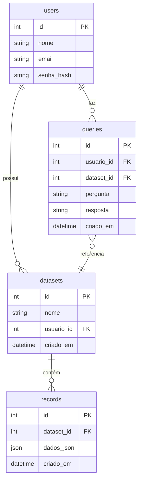

# 🧠 Desafio Técnico Nuven Backend

API RESTful para ingestão, extração e gerenciamento inteligente de documentos, com autenticação JWT, upload de arquivos, extração de conteúdo e simulação de perguntas/respostas com IA (Hugging Face).  
Projeto criado como parte do desafio técnico para vaga de Desenvolvedor Backend.

---

## 📌 Objetivo

Desenvolver uma plataforma backend centralizada que permita:

- 📂 Upload e ingestão de arquivos (.csv/.pdf)
- 👤 Autenticação e controle de acesso por JWT
- 🔍 Registro e histórico de consultas simuladas via IA
- 💾 Persistência com PostgreSQL (via Prisma ORM)
- 📄 Documentação Swagger para uso da API

---

## 🚀 Tecnologias Utilizadas

| Tecnologia                | Descrição                        |
|---------------------------|----------------------------------|
| **Node.js + Express**     | Backend da API                   |
| **PostgreSQL + Prisma**   | Banco relacional + ORM           |
| **JWT + Bcrypt**          | Segurança e autenticação         |
| **Supabase Storage**      | Armazenamento de arquivos        |
| **HuggingFace Inference** | Integração com IA                |
| **Multer**                | Upload de arquivos               |
| **Swagger UI**            | Documentação automática          |
| **Docker + Compose**      | Containerização do ambiente      |

---

## 🧱 Modelagem de Dados



---

## 📂 Endpoints da API

> **Obs:** Toda a API é protegida por JWT, exceto `/auth/register` e `/auth/login`.

### 🔐 Autenticação

| Método | Rota             | Descrição                        |
|--------|------------------|----------------------------------|
| POST   | `/auth/register` | Registro de novo usuário         |
| POST   | `/auth/login`    | Login e retorno do token JWT     |
| GET    | `/auth/me`       | Dados do usuário autenticado     |

### 📤 Datasets e Upload

| Método | Rota                        | Descrição                                |
|--------|-----------------------------|------------------------------------------|
| POST   | `/datasets/upload`          | Upload de `.csv` ou `.pdf`               |
| GET    | `/datasets`                 | Lista todos os datasets do usuário       |
| GET    | `/datasets/:id/records`     | Lista registros de um dataset específico |
| GET    | `/datasets/search?query=`   | Busca textual entre registros JSON       |
| DELETE | `/datasets/:id`             | Deleta dataset e registros associados    |

### 🧠 Consultas por IA

| Método | Rota        | Descrição                                 |
|--------|-------------|-------------------------------------------|
| POST   | `/queries`  | Envia pergunta e recebe resposta por IA   |
| GET    | `/queries`  | Histórico de consultas do usuário         |

---

## 🐳 Dockerização

### Pré-requisitos

- Docker e Docker Compose instalados

### Passos

1. **Clone o repositório**
   ```bash
   git clone https://github.com/LucasBrbs/nuvenDevBackend.git
   cd nuvenDevBackend
   ```

2. **Crie o arquivo `.env`**
   ```bash
   # Crie e popule o .env com as chaves enviadas via email
   ```

3. **Suba a aplicação**
   ```bash
   docker-compose up --build
   ```

4. **Acesse a API**
   - API: [http://localhost:3000](http://localhost:3000)
   - Swagger: [http://localhost:3000/api-docs](http://localhost:3000/api-docs)

---

## 📄 .env

enviado via email

---

## 🔎 Swagger

Acesse [http://localhost:3000/api-docs](http://localhost:3000/api-docs) para visualizar e testar os endpoints interativamente via Swagger UI.

---

## 🧠 Exemplo de Consulta IA
Modelo da IA: moonshotai/Kimi-K2-Instruct

```http
POST /queries
Authorization: Bearer <token>
Content-Type: application/json

{
  "pergunta": "Quais são os principais dados do documento?",
  "datasetId": 2
}
```

Resposta:

```json
{
  "id": 12,
  "pergunta": "...",
  "resposta": "Com base no conteúdo, os principais pontos são...",
  "dataset_id": 2,
  "usuario_id": 1,
  "criado_em": "2025-07-21T10:00:00Z"
}
```

---

## ✅ Critérios Atendidos

- [x] JWT + Middleware de autenticação
- [x] Upload com Multer
- [x] Extração de texto de PDF e CSV
- [x] Integração real com IA (Hugging Face)
- [x] Documentação Swagger
- [x] Banco de dados PostgreSQL com Prisma
- [x] Histórico de perguntas/respostas
- [x] Pronto para deploy com Docker
- [x] Testes unitários mock 


---

## 🛠️ Desenvolvimento Local (sem Docker)

```bash
npm install
npx prisma migrate dev
npm run dev
```

---

## 📬 Contato

Desenvolvido por [Lucas Barbosa de Oliveira] – 💼 [lucasbarbosa2807@gmail.com]  
🔗 [LinkedIn](https://www.linkedin.com/in/lucasbrbs) • [GitHub](https://github.com/LucasBrbs)
